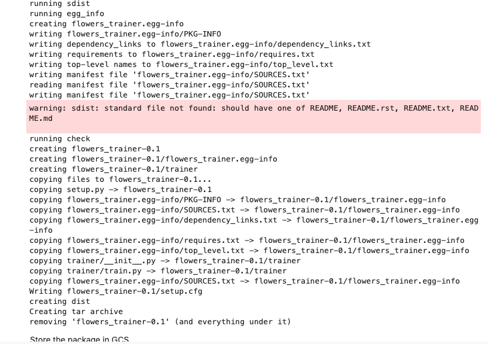

# GCP-LAB-Explaining-an-Image-Classification-Model-with-Vertex-Explainable-AI
Explaining an Image Classification Model with Vertex Explainable AI

#### Overview
This lab shows how to train a classification model on image data and deploy it to Vertex AI to serve predictions with explanations (feature attributions).

#### Learning objectives
1. Build and train a custom image classification model with Vertex AI.
2. Deploy the model to an endpoint.
3. Serve predictions with explanations.
4. Visualize feature attributions from Integrated Gradients.

#### Enable the Notebooks API
1. In the Google Cloud Console, on the Navigation menu, click APIs & Services > Library.

2. Search for Notebooks API and press ENTER.

3. Click on the Notebooks API result, and if the API is not enabled, click Enable.

#### Enable the Vertex AI API
1. In the Google Cloud Console, on the Navigation menu, click Vertex AI > Dashboard.

2. Click ENABLE ALL RECOMMENDED APIS.


### Task 1. Open Vertex AI Workbench instance
1. In the Google Cloud Console, on the Navigation Menu, click Vertex AI > Workbench.

2. On the Instance page, click CREATE NEW.

3. Please use the default zone and region: us-central1-c us-central1. Leave the remaining settings as they are and then click Create. The new VM will take 2-3 minutes to start.


4. Click Open JupyterLab. A JupyterLab window will open in a new tab.


### Task 2. Clone a course repo within your Vertex AI Workbench instance
To clone the notebook in your JupyterLab instance:

1. In JupyterLab, open a new terminal window.

2. At the command-line prompt, run the following command:

``` 
git clone https://github.com/GoogleCloudPlatform/asl-ml-immersion.git
cd asl-ml-immersion
export PATH=$PATH:~/.local/bin
make install 
```


3. To confirm that you have cloned the repository, double-click on the asl-ml-immersion directory and ensure that you can see its contents. The files for all the Jupyter notebook-based labs throughout this course are available in this directory.


### Task 3. Get Explainability for a TensorFlow model on Vertex AI
1. In the notebook interface, navigate to asl-ml-immersion > notebooks > responsible_ai > explainable_ai > solutions and open xai_image_vertex.ipynb.

2. In the notebook interface, click Edit > Clear All Outputs.

3. Carefully read through the notebook instructions and run through the notebook.

>Tip: To run the current cell, click the cell and press SHIFT+ENTER. Other cell commands are listed in the notebook UI under Run.


### AI Explanations: Deploying an Explainable Image Model with Vertex AI¶

### Overview
This lab shows how to train a classification model on image data and deploy it to Vertex AI to serve predictions with explanations (feature attributions). In this lab you will:

- Explore the dataset
- Build and train a custom image classification model with Vertex AI
- Deploy the model to an endpoint
- Serve predictions with explanations
- Visualize feature attributions from Integrated Gradients

#### Setup
Import libraries
Import the libraries for this tutorial.

```
import base64
import os
import random
from datetime import datetime
from io import BytesIO

import matplotlib.image as mpimg
import numpy as np
import tensorflow as tf
import tensorflow_hub as hub
from google.cloud import aiplatform
from matplotlib import pyplot as plt
```

```
PROJECT = !(gcloud config get-value core/project)
PROJECT = PROJECT[0]
BUCKET = PROJECT  # defaults to PROJECT
REGION = "us-central1"  # Replace with your REGION

TIMESTAMP = datetime.now().strftime("%Y%m%d%H%M%S")
BUCKET = PROJECT
REGION = "us-central1"
GCS_PATTERN = "gs://asl-public/data/flowers-xai/*.tfrec"
DATA_PATH = f"gs://{BUCKET}/flowers/data"
OUTDIR = f"gs://{BUCKET}/flowers/model_{TIMESTAMP}"

os.environ["BUCKET"] = BUCKET
os.environ["REGION"] = REGION
os.environ["DATA_PATH"] = DATA_PATH
os.environ["OUTDIR"] = OUTDIR
os.environ["TIMESTAMP"] = TIMESTAMP
print(f"Project: {PROJECT}")
```

Run the following cell to create your Cloud Storage bucket if it does not already exist.

```
%%bash
exists=$(gsutil ls -d | grep -w gs://${BUCKET}/)

if [ -n "$exists" ]; then
   echo -e "Bucket gs://${BUCKET} already exists."
    
else
   echo "Creating a new GCS bucket."
   gsutil mb -l ${REGION} gs://${BUCKET}
   echo -e "\nHere are your current buckets:"
   gsutil ls
fi
```
Bucket gs://qwiklabs-gcp-01-4b8299c76960 already exists.


#### Explore the Dataset
The dataset used for this tutorial is the flowers dataset from TensorFlow Datasets. This section shows how to shuffle, split, and copy the files to your GCS bucket.


##### Load, split, and copy the dataset to your GCS bucket

```
TRAINING_DATA_PATH = DATA_PATH + "/training"
EVAL_DATA_PATH = DATA_PATH + "/validation"
VALIDATION_SPLIT = 0.2

# Split data files between training and validation
filenames = tf.io.gfile.glob(GCS_PATTERN)
random.shuffle(filenames)
split = int(len(filenames) * VALIDATION_SPLIT)
training_filenames = filenames[split:]
validation_filenames = filenames[:split]

# Copy training files to GCS
for file in training_filenames:
    !gsutil -m cp $file $TRAINING_DATA_PATH/

# Copy eval files to GCS
for file in validation_filenames:
    !gsutil -m cp $file $EVAL_DATA_PATH/
```


Run the following commands. You should see a number of .tfrec files in your GCS bucket at both gs://{BUCKET}/flowers/data/training and gs://{BUCKET}/flowers/data/validation

`!gsutil ls -l $TRAINING_DATA_PATH`


`!gsutil ls -l $EVAL_DATA_PATH`


##### Create ingest functions and visualize some of the examples
Define and execute helper functions to plot the images and corresponding labels.

```
IMAGE_SIZE = [192, 192]
BATCH_SIZE = 32

# Do not change, maps to the labels in the data
CLASSES = [
    "daisy",
    "dandelion",
    "roses",
    "sunflowers",
    "tulips",
]


def read_tfrecord(example):
    features = {
        "image": tf.io.FixedLenFeature(
            [], tf.string
        ),  # tf.string means bytestring
        "class": tf.io.FixedLenFeature([], tf.int64),  # shape [] means scalar
        "one_hot_class": tf.io.VarLenFeature(tf.float32),
    }
    example = tf.io.parse_single_example(example, features)
    image = tf.image.decode_jpeg(example["image"], channels=3)
    image = (
        tf.cast(image, tf.float32) / 255.0
    )  # convert image to floats in [0, 1] range
    image = tf.reshape(image, [*IMAGE_SIZE, 3])
    one_hot_class = tf.sparse.to_dense(example["one_hot_class"])
    one_hot_class = tf.reshape(one_hot_class, [5])
    return image, one_hot_class


# Load tfrecords into tf.data.Dataset
def load_dataset(gcs_pattern):
    filenames = tf.io.gfile.glob(gcs_pattern + "/*")
    ds = tf.data.TFRecordDataset(filenames).map(read_tfrecord)
    return ds


# Converts N examples in dataset to numpy arrays
def dataset_to_numpy(dataset, N):
    numpy_images = []
    numpy_labels = []

    for images, labels in dataset.take(N):
        numpy_images.append(images.numpy())
        numpy_labels.append(labels.numpy())

    return numpy_images, numpy_labels


def display_one_image(image, title, subplot):
    plt.subplot(subplot)
    plt.axis("off")
    plt.imshow(image)
    plt.title(title, fontsize=16)
    return subplot + 1


def display_9_images_from_dataset(dataset):
    subplot = 331
    plt.figure(figsize=(13, 13))
    images, labels = dataset_to_numpy(dataset, 9)
    for i, image in enumerate(images):
        title = CLASSES[np.argmax(labels[i], axis=-1)]
        subplot = display_one_image(image, title, subplot)
        if i >= 8:
            break

    plt.tight_layout()
    plt.subplots_adjust(wspace=0.1, hspace=0.1)
    plt.show()


# Display 9 examples from the dataset
ds = load_dataset(gcs_pattern=TRAINING_DATA_PATH)
display_9_images_from_dataset(ds)
```


##### Build training pipeline
In this section you will build an application with keras to train an image classification model on Vertex AI Custom Training.

Create a directory for the training application and an __ init __.py file (this is required for a Python application but it can be empty).

```
%%bash 
mkdir -p flowers/trainer
touch flowers/trainer/__init__.py
```


##### Create training application in train.py
This code contains the training logic. Here you build an application to ingest data from GCS and train an image classification model using mobileNet as a feature extractor, then sending it's output feature vector through a tf.keras.dense layer with 5 units and softmax activation (because there are 5 possible labels). Also, use the fire library which enables arguments to train_and_evaluate to be passed via the command line.


```
%%writefile flowers/trainer/train.py
import datetime
import fire
import os
import tensorflow as tf
import tensorflow_hub as hub

IMAGE_SIZE = [192, 192]


def read_tfrecord(example):

    features = {
        "image": tf.io.FixedLenFeature(
            [], tf.string
        ),  # tf.string means bytestring
        "class": tf.io.FixedLenFeature([], tf.int64),  # shape [] means scalar
        "one_hot_class": tf.io.VarLenFeature(tf.float32),
    }
    example = tf.io.parse_single_example(example, features)
    image = tf.image.decode_jpeg(example["image"], channels=3)
    image = (
        tf.cast(image, tf.float32) / 255.0
    )  # convert image to floats in [0, 1] range
    image = tf.reshape(
        image, [*IMAGE_SIZE, 3]
    )
    one_hot_class = tf.sparse.to_dense(example["one_hot_class"])
    one_hot_class = tf.reshape(one_hot_class, [5])
    return image, one_hot_class


def load_dataset(gcs_pattern, batch_size=32, training=True):
    filenames = tf.io.gfile.glob(gcs_pattern)
    ds = tf.data.TFRecordDataset(filenames).map(
        read_tfrecord).batch(batch_size)
    if training:
        return ds.repeat()
    else:
        return ds


def build_model():
    # MobileNet model for feature extraction
    mobilenet_v2 = 'https://tfhub.dev/google/imagenet/'\
        'mobilenet_v2_100_192/feature_vector/5'
    feature_extractor_layer = hub.KerasLayer(
        mobilenet_v2,
        input_shape=[*IMAGE_SIZE, 3],
        trainable=False
    )

    # Instantiate model
    model = tf.keras.Sequential([
        feature_extractor_layer,
        tf.keras.layers.Dense(5, activation="softmax")
    ])

    model.compile(optimizer="adam",
                  loss="categorical_crossentropy",
                  metrics=["accuracy"])

    return model


def train_and_evaluate(train_data_path,
                       eval_data_path,
                       output_dir,
                       batch_size,
                       num_epochs,
                       train_examples):

    model = build_model()
    train_ds = load_dataset(gcs_pattern=train_data_path,
                            batch_size=batch_size)
    eval_ds = load_dataset(gcs_pattern=eval_data_path,
                           training=False)
    num_batches = batch_size * num_epochs
    steps_per_epoch = train_examples // num_batches

    history = model.fit(
        train_ds,
        validation_data=eval_ds,
        epochs=num_epochs,
        steps_per_epoch=steps_per_epoch,
        verbose=2,  # 0=silent, 1=progress bar, 2=one line per epoch
    )

    model.save(output_dir)

    print("Exported trained model to {}".format(output_dir))

if __name__ == "__main__":
    fire.Fire(train_and_evaluate)

```

>Writing flowers/trainer/train.py


##### Test training application locally
It's always a good idea to test out a training application locally (with only a few training steps) to make sure the code runs as expected.

```
%%bash
OUTDIR_LOCAL=local_test_training
rm -rf ${OUTDIR_LOCAL}
export PYTHONPATH=${PYTHONPATH}:${PWD}/flowers
python3 -m trainer.train \
    --train_data_path=gs://${BUCKET}/flowers/data/training/*.tfrec \
    --eval_data_path=gs://${BUCKET}/flowers/data/validation/*.tfrec \
    --output_dir=${OUTDIR_LOCAL} \
    --batch_size=1 \
    --num_epochs=1 \
    --train_examples=10 
```


##### Package code as source distribution
Now that you have validated your model training code, we need to package our code as a source distribution in order to submit a custom training job to Vertex AI.

```
%%writefile flowers/setup.py
from setuptools import find_packages
from setuptools import setup

setup(
    name='flowers_trainer',
    version='0.1',
    packages=find_packages(),
    include_package_data=True,
    install_requires=['fire==0.4.0', 'tensorflow-hub==0.12.0'],
    description='Flowers image classifier training application.'
)
```
>Writing flowers/setup.py


```
%%bash
cd flowers
python ./setup.py sdist --formats=gztar
cd ..
```





```
%%bash
gsutil cp flowers/dist/flowers_trainer-0.1.tar.gz gs://${BUCKET}/flowers/
```


To submit to the Cloud we use gcloud custom-jobs create and simply specify some additional parameters for the Vertex AI Training Service:

display-name: A unique identifier for the Cloud job. We usually append system time to ensure uniqueness
region: Cloud region to train in. See here for supported Vertex AI Training Service regions
You might have earlier seen gcloud ai custom-jobs create executed with the worker pool spec and pass-through Python arguments specified directly in the command call, here we will use a YAML file, this will make it easier to transition to hyperparameter tuning.

Through the args: argument we add in the passed-through arguments for our task.py file.

```
%%bash
JOB_NAME=flowers_${TIMESTAMP}

PYTHON_PACKAGE_URI=gs://${BUCKET}/flowers/flowers_trainer-0.1.tar.gz
PYTHON_PACKAGE_EXECUTOR_IMAGE_URI="us-docker.pkg.dev/vertex-ai/training/tf-cpu.2-11.py310:latest"
PYTHON_MODULE=trainer.train

echo > ./config.yaml \
"workerPoolSpecs:
  machineSpec:
    machineType: n1-standard-8
  replicaCount: 1
  pythonPackageSpec:
    executorImageUri: $PYTHON_PACKAGE_EXECUTOR_IMAGE_URI
    packageUris: $PYTHON_PACKAGE_URI
    pythonModule: $PYTHON_MODULE
    args:
    - --train_data_path=gs://${BUCKET}/flowers/data/training/*.tfrec
    - --eval_data_path=gs://${BUCKET}/flowers/data/validation/*.tfrec
    - --output_dir=$OUTDIR
    - --num_epochs=15
    - --train_examples=15000
    - --batch_size=32
    "

gcloud ai custom-jobs create \
  --region=${REGION} \
  --display-name=$JOB_NAME \
  --config=config.yaml
```


>NOTE Model training will take 5 minutes or so. You have to wait for training to finish before moving forward.


##### Serving function for image data
To pass images to the prediction service, you encode the compressed (e.g., JPEG) image bytes into base 64 -- which makes the content safe from modification while transmitting binary data over the network. Since this deployed model expects input data as raw (uncompressed) bytes, you need to ensure that the base 64 encoded data gets converted back to raw bytes before it is passed as input to the deployed model.

To resolve this, define a serving function (serving_fn) and attach it to the model as a preprocessing step. Add a @tf.function decorator so the serving function is fused to the underlying model (instead of upstream on a CPU).

When you send a prediction or explanation request, the content of the request is base 64 decoded into a Tensorflow string (tf.string), which is passed to the serving function (serving_fn). The serving function preprocesses the tf.string into raw (uncompressed) numpy bytes (preprocess_fn) to match the input requirements of the model:

io.decode_jpeg- Decompresses the JPG image which is returned as a Tensorflow tensor with three channels (RGB).
image.convert_image_dtype - Changes integer pixel values to float 32.
image.resize - Resizes the image to match the input shape for the model.
resized / 255.0 - Rescales (normalization) the pixel data between 0 and 1.
At this point, the data can be passed to the model (m_call).

XAI Signatures
When the serving function is saved back with the underlying model (tf.saved_model.save), you specify the input layer of the serving function as the signature serving_default.

For XAI image models, you need to save two additional signatures from the serving function:

xai_preprocess: The preprocessing function in the serving function.
xai_model: The concrete function for calling the model.

>Load the model into memory. NOTE This directory will not exist if your model has not finished training. Please wait for training to complete before moving forward

`local_model = tf.keras.models.load_model(OUTDIR)`

`local_model.summary()`


```
CONCRETE_INPUT = "numpy_inputs"


def _preprocess(bytes_input):
    decoded = tf.io.decode_jpeg(bytes_input, channels=3)
    decoded = tf.image.convert_image_dtype(decoded, tf.float32)
    resized = tf.image.resize(decoded, size=(192, 192))
    return resized


@tf.function(input_signature=[tf.TensorSpec([None], tf.string)])
def preprocess_fn(bytes_inputs):
    decoded_images = tf.map_fn(
        _preprocess, bytes_inputs, dtype=tf.float32, back_prop=False
    )
    return {
        CONCRETE_INPUT: decoded_images
    }  # User needs to make sure the key matches model's input


@tf.function(input_signature=[tf.TensorSpec([None], tf.string)])
def serving_fn(bytes_inputs):
    images = preprocess_fn(bytes_inputs)
    prob = m_call(**images)
    return prob


# the function that sends data through the model itself and returns
# the output probabilities
m_call = tf.function(local_model.call).get_concrete_function(
    [
        tf.TensorSpec(
            shape=[None, 192, 192, 3], dtype=tf.float32, name=CONCRETE_INPUT
        )
    ]
)

tf.saved_model.save(
    local_model,
    OUTDIR,
    signatures={
        "serving_default": serving_fn,
        # Required for XAI
        "xai_preprocess": preprocess_fn,
        "xai_model": m_call,
    },
)
```


#### Get the serving function signature
You can get the signatures of your model's input and output layers by reloading the model into memory, and querying it for the signatures corresponding to each layer.

When making a prediction request, you need to route the request to the serving function instead of the model, so you need to know the input layer name of the serving function -- which you will use later when you make a prediction request.

You also need to know the name of the serving function's input and output layer for constructing the explanation metadata -- which is discussed subsequently.

```
loaded = tf.saved_model.load(OUTDIR)

serving_input = list(
    loaded.signatures["serving_default"].structured_input_signature[1].keys()
)[0]
print("Serving function input:", serving_input)
serving_output = list(
    loaded.signatures["serving_default"].structured_outputs.keys()
)[0]
print("Serving function output:", serving_output)

input_name = local_model.input.name
print("Model input name:", input_name)
output_name = local_model.output.name
print("Model output name:", output_name)
```

>Serving function input: bytes_inputs
Serving function output: output_0
Model input name: keras_layer_input
Model output name: dense/Softmax:0

```
parameters = aiplatform.explain.ExplanationParameters(
    {"integrated_gradients_attribution": {"step_count": 50}}
)
```


#### Upload the model
Next, upload your model to a Model resource using Model.upload() method, with the following parameters:

display_name: The human readable name for the Model resource.
artifact: The Cloud Storage location of the trained model artifacts.
serving_container_image_uri: The serving container image.
sync: Whether to execute the upload asynchronously or synchronously.
explanation_parameters: Parameters to configure explaining for Model's predictions.
explanation_metadata: Metadata describing the Model's input and output for explanation.
If the upload() method is run asynchronously, you can subsequently block until completion with the wait() method.

```
MODEL_NAME = "flower_classifier_v1"
INPUT_METADATA = {"input_tensor_name": CONCRETE_INPUT, "modality": "image"}
OUTPUT_METADATA = {"output_tensor_name": serving_output}

input_metadata = aiplatform.explain.ExplanationMetadata.InputMetadata(
    INPUT_METADATA
)
output_metadata = aiplatform.explain.ExplanationMetadata.OutputMetadata(
    OUTPUT_METADATA
)

metadata = aiplatform.explain.ExplanationMetadata(
    inputs={"image": input_metadata}, outputs={"class": output_metadata}
)
```

>NOTE This can take a few minutes to run.


```
aiplatform.init(project=PROJECT, staging_bucket=BUCKET)
model = aiplatform.Model.upload(
    display_name=MODEL_NAME,
    artifact_uri=OUTDIR,
    serving_container_image_uri="us-docker.pkg.dev/vertex-ai/prediction/tf2-cpu.2-11:latest",
    explanation_parameters=parameters,
    explanation_metadata=metadata,
    sync=False,
)

model.wait()
```

>Creating Model
Create Model backing LRO: projects/206245758132/locations/us-central1/models/2350734969464160256/operations/2314291209884925952


#### Deploy the model
Next, deploy your model for online prediction. To deploy the model, you invoke the deploy method, with the following parameters:

deployed_model_display_name: A human readable name for the deployed model.
traffic_split: Percent of traffic at the endpoint that goes to this model, which is specified as a dictionary of one or more key/value pairs. If only one model, then specify as { "0": 100 }, where "0" refers to this model being uploaded and 100 means 100% of the traffic. If there are existing models on the endpoint, for which the traffic will be split, then use model_id to specify as { "0": percent, model_id: percent, ... }, where model_id is the model id of an existing model to the deployed endpoint. The percents must add up to 100.
machine_type: The type of machine to use for training.
max_replica_count: The maximum number of compute instances to scale to. In this tutorial, only one instance is provisioned.


>NOTE This can take a few minutes.


```
endpoint = model.deploy(
    deployed_model_display_name=MODEL_NAME,
    traffic_split={"0": 100},
    machine_type="n1-standard-4",
    min_replica_count=1,
    max_replica_count=1,
)
```


##### Prepare the request content
You are going to send the flower image as compressed JPG image, instead of the raw uncompressed bytes:

mpimg.imsave: Write the uncompressed image to disk as a compressed JPEG image.
tf.io.read_file: Read the compressed JPG images back into memory as raw bytes.
base64.b64encode: Encode the raw bytes into a base 64 encoded string.

```
eval_ds = load_dataset(EVAL_DATA_PATH)
x_test, y_test = dataset_to_numpy(eval_ds, 5)

# Single image from eval dataset
test_image = x_test[0]

# Write image out as jpg
mpimg.imsave("tmp.jpg", test_image)
```


Read the JPG image and encode it with base64 to send to the model endpoint. Send the encoded image to the endpoint with endpoint.explain. Then you can parse the response for the prediction and explanation. Full documentation on endpoint.explain can be found here.

```
# Read image and base64 encode
bytes = tf.io.read_file("tmp.jpg")
b64str = base64.b64encode(bytes.numpy()).decode("utf-8")

instances_list = [{serving_input: {"b64": b64str}}]

# Get prediction with explanation
response = endpoint.explain(instances_list)
print(response)
```

##### Visualize feature attributions from Integrated Gradients.
Query the response to get predictions and feature attributions. Use Matplotlib to visualize.

```
import io
from io import BytesIO

import matplotlib.image as mpimg
import matplotlib.pyplot as plt

CLASSES = [
    "daisy",
    "dandelion",
    "roses",
    "sunflowers",
    "tulips",
]

# Parse prediction
for prediction in response.predictions:
    label_index = np.argmax(prediction)
    class_name = CLASSES[label_index]
    confidence_score = prediction[label_index]
    print(
        "Predicted class: "
        + class_name
        + "\n"
        + "Confidence score: "
        + str(confidence_score)
    )

    image = base64.b64decode(b64str)
    image = BytesIO(image)
    img = mpimg.imread(image, format="JPG")

# Parse explanation
for explanation in response.explanations:
    attributions = dict(explanation.attributions[0].feature_attributions)
    xai_label_index = explanation.attributions[0].output_index[0]
    xai_class_name = CLASSES[xai_label_index]
    xai_b64str = attributions["image"]["b64_jpeg"]
    xai_image = base64.b64decode(xai_b64str)
    xai_image = io.BytesIO(xai_image)
    xai_img = mpimg.imread(xai_image, format="JPG")

# Plot image, feature attribution mask, and overlayed image
fig = plt.figure(figsize=(13, 18))
fig.add_subplot(1, 3, 1)
plt.title("Input Image")
plt.imshow(img)
fig.add_subplot(1, 3, 2)
plt.title("Feature Attribution Mask")
plt.imshow(xai_img)
fig.add_subplot(1, 3, 3)
plt.title("Overlayed Attribution Mask")
plt.imshow(img)
plt.imshow(xai_img, alpha=0.6)
plt.show()
```


